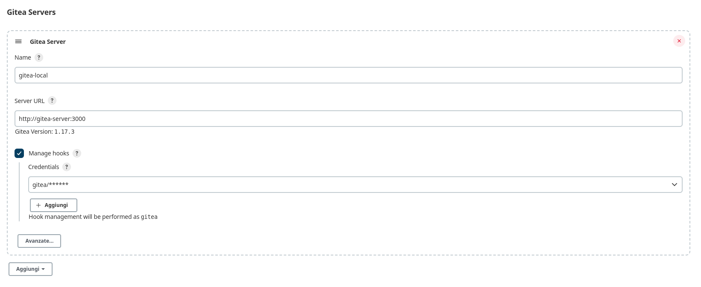
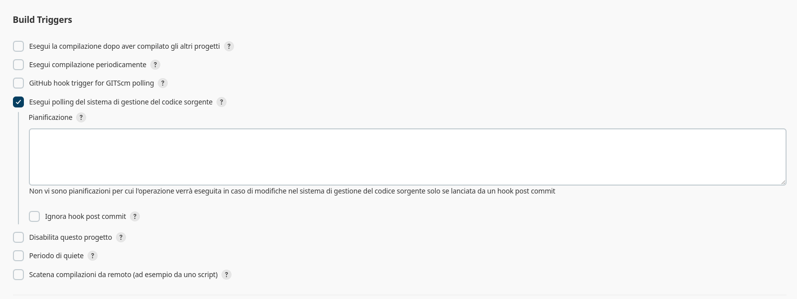
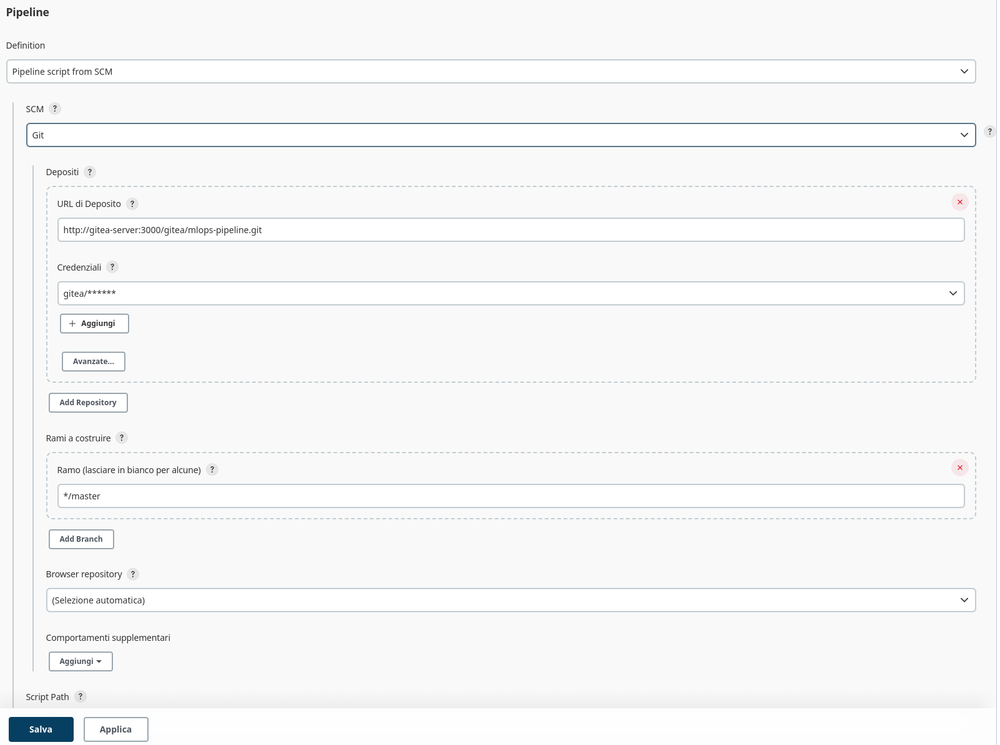

# MLOps Pipeline Environment Setup

Start the containers with docker-compose.
```bash
docker compose up -d
```

## .env File

For convenience, in this tutorial we use the default .env file, creating a copy of .env.example in .env
```
cp .env.example .env
```

## Network setup
Add the following entries to your /etc/hosts:
```
127.0.0.1	gitea-server
127.0.0.1	jenkins
127.0.0.1	postgres-single
```

## Gitea
- Open the [dashboard](gitea-server:3000), leave everything unchanged, only adding the administrator user section at the bottom of the page, entering:
    - name: gitea
    - password: gitea
    - email: git@tea.com
- Add SSH public key in the user profile
- Create a repository ("mlops-pipeline" in this example)
- Command to add remote origin:
    ```bash
    git remote add origin ssh://git@gitea-server222/gitea/mlops-pipeline.git
    ```
- Modify the app.ini file (gitea/gitea/conf/app.ini) so it has:

        ROOT_URL         = http://gitea-server:3000/
        ...
        [webhook]
        ALLOWED_HOST_LIST = jenkins
    

## Jenkins

### Configuration
- Open the [dashboard](jenkins:8080). Retrieve and enter the admin password with the command:
  ```bash
    docker exec -it jenkins bash
    cat /var/jenkins_home/secrets/initialAdminPassword
    ```
    or by opening the container log.

- Install the suggested add-ons.
- Create the admin user:
    - username: jeknins
    - password: jenkins
    - full name: jenkins
    - email: jenkins@jenkins.jenkins
- Provide the URL for Jenkins: http://jenkins:8080
- Once the environment is configured, add the Gitea add-on and configure it:


### Pipeline
Create a new pipeline in Jenkins and configure it as follows:
- 
- 

Note: With this configuration, a Jenkinsfile must be present in the repository.


## Useful Links
- https://wiki.gcube-system.org/gcube/Gitea/Jenkins:_Setting_up_Webhooks

- https://discourse.gitea.io/t/webhooks-between-gitea-and-jenkins/2760